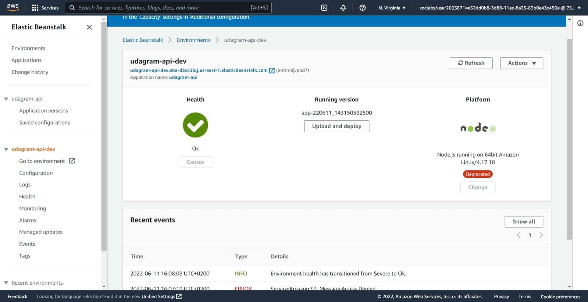

### App Architecture

* This website is being hosted on AWS.
* Elastic Beanstalk is used for the Backend API.
* S3 bucket for the frontend and uploaded images.
* RDS database running Postgres.

### screenshots:

* AWS RDS database

* AWS elastic beanstalk

* AWS S3 frontend bucket

